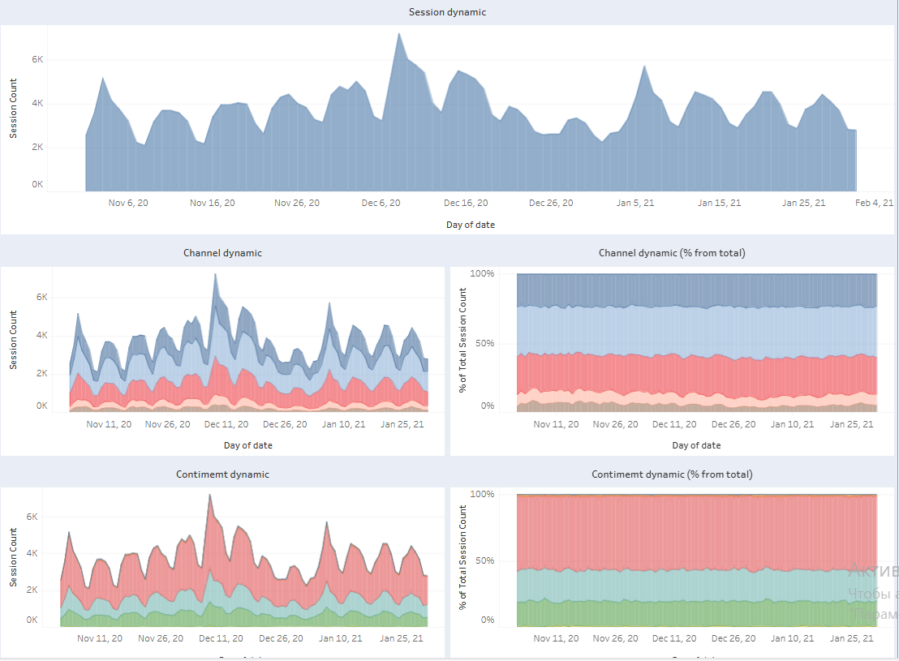

# SQL + Tableau | Session Behavior Analysis

## Short Summary

Interactive Tableau dashboard analyzing website session behavior across browsers, channels, devices, countries, languages, and operating systems.
The project focuses on traffic distribution, audience segmentation, and session dynamics over time.

## Project Overview

This project analyzes web session data and presents behavioral traffic insights in an interactive Tableau dashboard.

The objective was to:

- Monitor overall session dynamics over time

- Analyze traffic distribution by browser and operating system

- Compare channel performance and its contribution over time

- Evaluate geographic and continent-level traffic patterns

- Segment sessions by device type and language

The dashboard enables multi-dimensional traffic analysis using interactive filters and time-based comparisons.

## Data Source & Data Model

The analysis is based on a relational database containing session-level and event-level data.

### Core Tables:

- `session`

- `session_params`

The dataset connects session metadata (device, browser, country, channel, OS, language) with session date information.

### Data Granularity:
Aggregated at:

- date

- browser

- channel

- continent

- country

- device

- operating_system

- language

## Database Schema

See [Database Schema](docs/database_schema.png) for full relational model.

## Data Preparation (SQL Layer)

The reporting dataset was created using the following SQL query:
```
SELECT
    sp.*,
    s.date
FROM `data-analytics-mate.DA.session_params` sp
JOIN `DA.session` s
    ON sp.ga_session_id = s.ga_session_id
```
### Transformation Logic:

- Session-level attributes are retrieved from `session_params`

- Date dimension is added from the `session` table via `ga_session_id`

- The query creates a flat session-level dataset

- The resulting dataset is used directly in Tableau for aggregation and visualization

This structure allows flexible slicing of traffic metrics across multiple dimensions.

## Business Questions

- How does total session volume change over time?

- Which browsers generate the highest traffic?

- What is the distribution of traffic by marketing channels?

- How does channel contribution evolve over time (absolute and % share)?

- Which continents and countries generate the largest number of sessions?

- What is the device distribution of users?

- How does operating system usage vary across traffic?

## Dashboard Overview




The dashboard includes:

### Browser Analysis

- Session distribution by browser (treemap visualization)

- Identification of dominant browsers

### Channel Analysis

- Sessions by marketing channel (bubble chart)

- Channel dynamics over time

- Channel contribution (% of total sessions)

### Geographic Analysis

- World map with session distribution by country

- Continent-level traffic comparison

- Continent dynamics over time (absolute & % share)

### Device & OS Segmentation

- Device share (desktop, mobile, tablet)

- Operating system distribution

- Comparison of platform usage

### Language Analysis

- Session count by language

- Identification of dominant localization segments

### Time-Series Analysis

- Overall session dynamic over time

- Seasonal and peak activity identification

## Interactive Dashboard

  

[Open Dashboard on Tableau Public](https://public.tableau.com/views/SessionAnalysis_17417799168400/SessionAnalysis?:language=en-US&:sid=&:redirect=auth&:display_count=n&:origin=viz_share_link)

## Key Insights

- Desktop traffic dominates overall session share, followed by mobile

- Chrome is the leading browser with significant traffic volume

- Organic Search and Paid Search represent major traffic sources

- Channel contribution remains relatively stable over time

- Traffic is geographically concentrated in North America and Europe

- Session volume demonstrates periodic peaks indicating campaign or seasonal effects

## Tools & Technologies

- SQL (BigQuery syntax)

- Relational data modeling

- Session-level data aggregation

- Tableau Public

- Traffic & behavioral analytics

## Repository Structure
```
session-behavior-dashboard/

README.md

sql/
  session_dataset_query.sql

docs/
  database_schema.png

dashboard/
  session_dashboard.twbx

screenshots/
  dashboard_preview1.png
  dashboard_preview2.png
```
