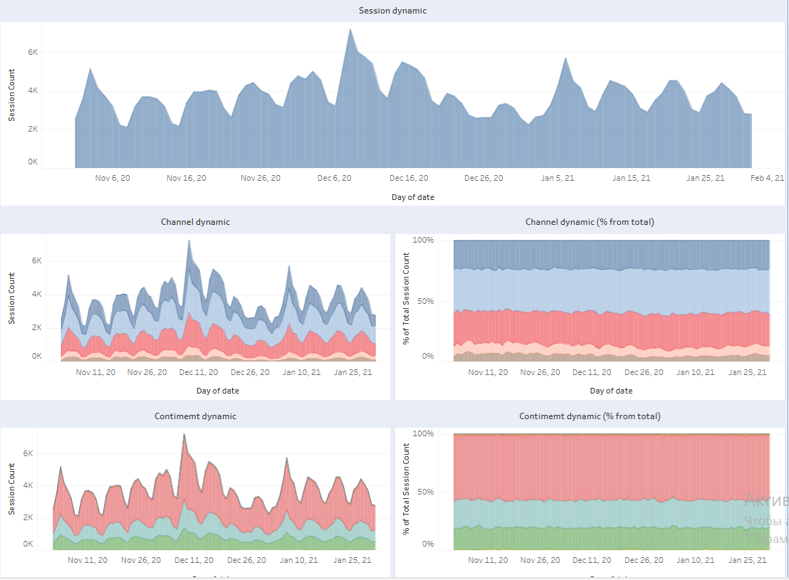

# Session Behavior Analysis Dashboard

## Project Overview

This project analyzes web session data and presents behavioral traffic insights in an interactive Tableau dashboard.
The dataset was extracted from BigQuery by joining session metadata with date information, creating a flat session-level dataset used directly in Tableau for aggregation and visualization.

The objective was to:

- Monitor overall session dynamics over time

- Analyze traffic distribution by browser and operating system

- Compare channel performance and its contribution over time

- Evaluate geographic and continent-level traffic patterns

- Segment sessions by device type and language

## Tools & Technologies

- SQL (BigQuery)

- Tableau Public

## Database Structure

The analysis is based on two core tables from a relational database:

- `session` – session ID and date

- `session_params` – session-level attributes (device, browser, country, continent, channel, operating system, language)

### Database Schema


## Data Preparation (SQL Layer)

[View SQL Query](sql/session_dataset_query.sql)

The reporting dataset was created by joining `session_params` with `session` via `ga_session_id` to enrich session attributes with date information. The query returns raw session-level data — all aggregation and metric calculation is performed in Tableau.

## Dashboard




The dashboard includes:

- **Browser Analysis** — session distribution by browser (treemap visualization)

- **Channel Analysis** — sessions by channel (bubble chart), channel dynamics over time, channel contribution (% of total)

- **Geographic Analysis** — world map with session distribution, continent-level traffic comparison, continent dynamics (absolute & % share)

- **Device & OS Segmentation** — device share breakdown, operating system distribution

- **Language Analysis** — session count by language

- **Time-Series Analysis** — overall session dynamics, channel and continent trends over time

**Interactive filters:** date range, browser, channel, continent, country, device, operating system.

🔗 [Interactive dashboard on Tableau Public](https://public.tableau.com/views/SessionAnalysis_17417799168400/SessionAnalysis?:language=en-US&:sid=&:redirect=auth&:display_count=n&:origin=viz_share_link)

## Key Insights

- Desktop dominates session share at **58.48%**, followed by mobile (**39.27%**) and tablet (**2.25%**)

- **Chrome** is the leading browser (238,460 sessions), followed by Safari (83,254)

- Top traffic channels: **Organic Search** (124,425), **Paid Search** (94,341), and **Direct** (81,382)

- Leading OS: **Web** (58.34%), followed by **Windows** (11.71%) and **Macintosh** (7.47%)

- Top language: **en-us** (159,893 sessions)

- Traffic is geographically concentrated in **North America** and **Europe**

- Session volume shows periodic peaks around early December 2020, indicating possible campaign or seasonal effects

- Channel contribution remains relatively stable over time

## How to Run

1. Clone this repository

2. Open [`sql/session_dataset_query.sql`](sql/session_dataset_query.sql) to review the BigQuery query

3. Explore the [interactive dashboard on Tableau Public](https://public.tableau.com/views/SessionAnalysis_17417799168400/SessionAnalysis?:language=en-US&:sid=&:redirect=auth&:display_count=n&:origin=viz_share_link) or download the [`.twbx` file](dashboard/session_dashboard.twbx) to open in Tableau

## Project Structure

```
session-behavior-dashboard/
├── sql/
│   └── session_dataset_query.sql
├── docs/
│   └── database_schema.png
├── dashboard/
│   └── session_dashboard.twbx
├── screenshots/
│   ├── dashboard_preview1.png
│   └── dashboard_preview2.png
└── README.md
```
